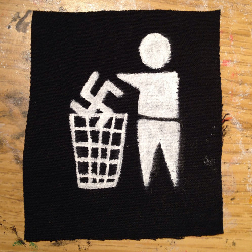

---

date: 16 November 2019

title: Know Your Rights at Demonstrations 

author: Eric M. Fink 
position: Associate Professor
affiliation: Elon Law School
address: Greensboro, North Carolina 

customtitle: true 
nohead: true 
norule: 0em
colorhead: true 
fontsize: 12pt

output: 
  pdf_document:
    latex_engine: xelatex
    template: default.latex
    
---

\thispagestyle{empty}

\\

\vspace{6cm}

\Large{This is a general overview of issues that may arise in political demonstrations and police encounters. The information presented is not offered or intended as legal advice.}

\vspace{10cm}

\footnotesize{This work is licensed under the Creative Commons Attribution-NonCommercial-ShareAlike 4.0 International License. http://creativecommons.org/licenses/by-nc-sa/4.0/}

\addtocounter{page}{-2}

\newpage 

# Freedom of Speech & Assembly 

## 1st Amendment 

> Congress shall make no law … abridging the freedom of speech, or of the press; or the right of the people peaceably to assemble, and to petition the Government for a redress of grievances.

The 1st Amendment protects against restraints on speech and assembly by _government action_. 

Proteted speech includes both verbal and non-verbal expression: 

**Body Language**                | **Clothing**                       | **Conduct**
:-----------------------------:|:--------------------------------:|:-----------------------------:
{width=33%} | {width=33%} | {width=33%}

## Scope of Protection 

Government _may not_ prohibit, restrain, limit, or punish protected 1st Amendment speech or assembly based on the content or subject of the expression, the viewpoint expressed, or the political affiliation or association of the speaker/participants. 

Government _may_ regulate the _time_, _place_, and _manner_ of speech or assembly. 

_Examples:_ 

- Permits for use of certain public places
- Noise ordinances & regulations of sound equipment
- Restrictions on posting signs or flyers
- Prohibitions against blocking pedestrians or traffic

Courts apply three criteria in assessing the validity of time, place, or manner restrictions: 

- They must be neutral (facially and as applied) with regard to content, viewpoint, and affiliation.
- They must be _narrowly-tailored_ to protect a _substantial government interest_. 
- They must leave open alternative channels of communication to reach the intended audience. 

## Public Forum 

1st Amendment protections are strongest in places traditionally open to unrestricted public speech & activity.

_Examples:_

- Sidewalks
- Parks
- Plazas outside government buildings

Within a public forum, these activities are generally permitted, usually without the requirement of a permit: 

- Peaceful demonstrations. 
  - Permits may be required for sound amplification. 
  - Permits may be required for demonstrations in certain public spaces, such as parks. 
- Signs, banners
  - There may be restrictions on poles or other material that could pose a danger. 
- Distribution of literature 
  - Posting leaflets on walls, lightposts, etc. may be unlawful. 

These activities may be restricted or prohibited, and may result in arrest: 

- Blocking sidewalks
- Blocking entry to and exit from buildings and public access areas
- Demonstrating or marching in the street without a permit. 
- Blocking traffic. 

The police may give a warning before arresting demonstrators. But they are not required to do so. 

It is generally a good idea to have someone designated to communicate with the police in the event they attempt to restrict 1st Amendment activity, or threaten/carry out arrests, during a demonstration. 

- You may ask the police to explain any restrictions on the activity. 
- You may ask the police why participants have been arrested and where they will be taken following arrest. 

Even if the police do not provide satisfactory answers, or you believe they are infringing on your 1st Amendment rights, arguing with them is typically futile and may lead to being charged with resisting arrest or other criminal offenses. 

\newpage

# Photographs & Recordings 

A person who is lawfully present in a public place may take photograph or make video recordings anything and any person (including police officers) in plain view. In North Carolina, this is also true for audio recordings in public places. 

- Permission of the person being photographed or recorded is not required. 
  - Many people do not understand this and may object that photographing or recording them without their permission is a violation of their privacy or other legal rights. 
- It is unlawful for any person to use physical force to stop you from taking photos or recordings in a public place.

The owner of private property may prohibit or restrict photography and video recording on the property. 

- But a property owner may not prohibit you from taking photos or video recordings of the property from a public place. 

The police may not lawfully prohibit you from, or arrest you for, taking photos or video recordings in a public place.

The police may not lawfully seize your equipment, demand to view your photos or video, or delete your photos or video without a warrant.

The police may lawfully order you to cease activity, including photography or video recording, if it is interfering with an arrest or other legitimate law enforcement activity.

\newpage 

# Police Encounters & Arrests 

## Police Questioning 

In general, a police officer may lawfully ask you questions at any time, without having to demonstrate reasonable suspicion or probable cause. 

If you speak to a law enforcement officer, your statements may be used against you and others.

It is a criminal offense to provide false information to a police officer.

### Constitutional Rights 

You have a right to refuse to answer police questions, and the right to consult with a lawyer before agreeing to speak to the police. 

- These rights apply whether or not you have been detained or arrested. 
- But the police are not required to inform you of these rights unless they intend to conduct a custodial interrogation (i.e. question you while under arrest or otherwise not free to go). 

#### Right to Remain Silent 

You are not required to tell the police that you are exercising your right to remain silent.

- But it is usually a good idea to do so. 

Even if you answer some questions, you may still stop and refuse to answer any further questions until you have a lawyer.

You may not lawfully be arrested or punished for failing or refusing to answer police questions.

#### Right to Counsel 

Police officers may try to pressure or persuade you to speak to them without a consulting a lawyer. Bear in mind that the police are legally permitted to lie to you. 

- They may say that you are better off without a lawyer. 
  - This is almost never true. 
- They may threaten you with a grand jury subpoena 
  - They may be bluffing and even if they’re not, you are entitled to consult with a lawyer before testifying
- They may promise leniency in criminal charges or sentencing.
  - Criminal charges and plea bargains are up to the prosecutor, not the police.
  
## Stops & Detention 

If you are stopped by a police officer, you are legally entitled to walk away unless you have been detained or arrested. 

If you’re unsure, you can ask if you are free to go. 

- It’s generally a good idea to walk away calmly. 
  - If you run, or otherwise act in a “furtive” “suspicious” manner, the officer might use that as a pretext to detain or arrest you. 
- It’s generally not a good idea to insult or argue with the officer.
  - Even though your statements may be protected under the 1st Amendment, it’s likely to provoke a bad response from the officer.  

Detention means that you have been stopped by a police officer and are not free to go.

- Detention may lead to an arrest, but it is not the same thing.

If you are detained, your constitutional rights (including the right to remain silent) apply, but the police are not required to inform you of those rights unless you are arrested. 

## Pat-Downs & Searches 

If you are detained, the officer may conduct a “pat down” (an external check) for weapons.

- Legally, a police officer is required to have “reasonable suspicion” that you are armed and dangerous before conducting a pat down. 
  - Police officers frequently cite “furtive” or “suspicious” movements or demeanor (e.g. “he reached for his waistband”) to justify a pat down. 

If you are detained but not arrested, the officer may not lawfully conduct any search beyond a pat-down (e.g. inside your pockets, under your clothing, inside a bag or other item) without your consent or “probable cause”. 

- You may tell a police officer you do not consent to a search. 
  - Refusal to consent is not probable cause for a search. 
  - If the officer proceeds (as they most likely will), you do not have a legal right to physically resist. 

Probable cause means that the officer has knowledge of facts sufficient to support a reasonable belief that you are engaged in criminal activity or have evidence of a crime in your possession. 

\newpage 

## Arrests 

Arrests, like searches, require probable cause. 

A police officer will usually tell you that you are being placed under arrest. If you are uncertain, you may ask. 

- The officer will not necessarily inform you of the charges at the time of arrest. 

Resisting arrest is a crime, even if the arrest itself is unlawful or the police use excessive force in carrying out the arrest. 

Once you have been placed under arrest, the police may lawfully conduct a search: 

- Inside your clothing and any objects you are holding or carrying. 
- The area within your immediate control.

### Miranda Warning 

If you are arrested, the police may not lawfully interrogate you without advising you of your right to refuse to answer questions and your right to legal representation. 

The police may recite the _Miranda_ warning at the time of arrest or at a later time prior to any interrogation. 

### Rights Following Arrest 

You have the right to make a phone call within a reasonable time after being arrested. 

- The police may not listen to your calls with your lawyer. 
- But they may (and mostly likely will) listen to any other calls. 

You have the right to appear before a judge or magistrate within a reasonable time after being arrested (usually within 48 hours). 

- The purpose of this appearance is to hear the formal charges against you, decide on bail, and enter a plea. 
  - You have a right to be represented by a lawyer at this and all other court appearances. 
  - If you can’t afford a lawyer, you have a right to be represented by a public defender or other court-appointed lawyer. 